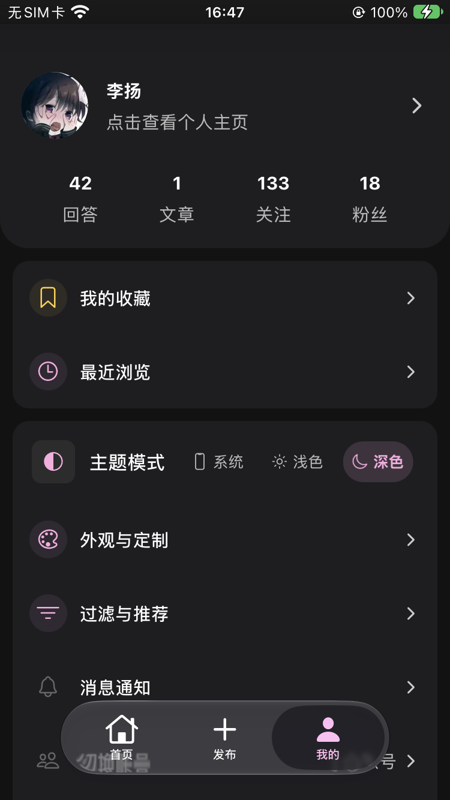

# 🐱 知乎-- (Zhihu Minus Minus)

> [!IMPORTANT]
> **🚧 项目声明**：本项目目前核心功能基本稳定，但仍有不完善之处；知乎 API 的变动也可能导致部分功能失效。
>
> 欢迎提交 Issue、Pull Request 或 Fork 参与改进。也可以看看其他客户端：
> - <https://github.com/zhihulite/Hydrogen>  
> - <https://github.com/zly2006/zhihu-plus-plus>


一款轻量级、纯净、无广告的第三方知乎客户端，基于 **React Native (Expo)** 构建。旨在回归阅读本质，提供极致丝滑的知乎浏览体验。

## ✨ 特性

- **纯净与轻量**: 只有你想看的内容，没有广告，没有臃肿的功能。
- **沉浸式体验**: 适配系统亮色与暗色模式，支持**全局主题色自定义**、阅读背景/对比度调整、支持感应设备自动旋转。
- **多账号与游客**: 支持**多账号无缝切换**，并提供基础阅读的**游客模式**（免登录浏览 Feed 流）。
- **完善的功能**:
  - **首页**: 热榜、推荐、关注动态、同城和知乎日报。顶部 Tab 实时联动，底部 Tab 支持点击刷新。
  - **滑动浏览**: 首页子频道、发布中心、个人中心通过统一的水平滑动轴无缝切换；问题详情页支持**左右滑动快速切换回答**。
  - **搜索**: 全站与个人主页深度搜索，支持联想词、综合/用户搜索、回答/文章/最新发布筛选及关键词高亮。
  - **内容渲染**: 集中维护的富文本渲染模块，支持图片、公式、链接卡片、段落互动与回答详情预取。
  - **创作发布**: 发布中心支持写回答、写文章、发想法和提问题；正文编辑器支持标题、粗体、引用、列表、链接及图片上传预览，回答支持搜索问题或查看受邀问题。
  - **互动交流**: 完善的评论区交互（支持查看和上传图片、二级回复、复制评论及删除自己的评论），支持文章 (Articles)、想法与话题 (Topics) 的展示与评论。
  - **个人中心**: 支持**多收藏夹管理**、**浏览历史记录云端同步**（可选开启/多选删除/一键清空）、全面的关注列表（用户/专栏/话题/收藏夹），并可查看关注用户的最近发布内容。
- **阅读与推荐控制**: 详情页支持恢复上次阅读位置；可选启用推荐流本地去重、启动缓存和内容过滤，过滤规则覆盖付费、推广、机构号、外链引流及内容质量。
- **深度链接 (Deep Linking)**: 完整支持 `zhihu.com` 外部链接及 `zhihu://` 协议唤起应用，知乎内部链接智能归一化跳转。
- **个性化交互设置**: 自由定制列表点击反馈（安卓水波纹 / 透明度+缩放模式）、iOS 原生底部 Tab、主屏幕 App 图标和应用内震动反馈。
- **一键更新**: 支持从 GitHub Releases 自动检测并下载安装新版本。
- **隐私控制**: 可在设置中关闭崩溃报告和匿名统计；未配置 Firebase/Sentry 的本地开发构建不会发送这些数据。
- **现代化架构**: 全面拥抱 Expo Router、TanStack Query V5、Tailwind CSS (NativeWind) 和 Zustand。

## 📸 界面预览

<div align="center">
  <table style="border-collapse: separate; border-spacing: 15px;">
    <tr>
      <td align="center" valign="top">
        
        <br /><br />
        <b>搜索</b><br />
      </td>
      <td align="center" valign="top">
        
        <br /><br />
        <b>问题详情</b><br />
      </td>
      <td align="center" valign="top">
        
        <br /><br />
        <b>夜间模式</b><br />
      </td>
      <td align="center" valign="top">
        
        <br /><br />
        <b>关注更新</b><br />
      </td>
      <td align="center" valign="top">
        
        <br /><br />
        <b>段落交互</b><br />
      </td>
    </tr>
  </table>
</div>

## 📦 下载与安装

### 🤖 Android

你可以直接前往 [GitHub Releases](https://github.com/huamurui/zhihu-minus-minus/releases) 下载最新的 APK 文件进行安装。

> [!NOTE]
> 请留意 APK 文件名。GitHub Release 会提供 `arm64-v8a`、`armeabi-v7a`、`x86` 和 `x86_64` 四个单 ABI APK；`arm64-v8a` 是默认验证过的主包，其余 `compat-*` 包目前主要用于兼容设备和模拟器，未完成完整实机验证。应用内更新会根据设备 ABI 选择匹配附件。

也可以从源码构建：

1. `git clone` 本仓库。
2. 安装环境（参考下方的 **快速开始**）。
3. 生成原生工程并运行本地 EAS 构建：

```bash
npm run prebuild
eas build --platform android --profile preview --local
```

本地 EAS 构建需要 Expo Token；如果启用了 telemetry，还要准备对应的 Firebase 配置文件和 Sentry 环境变量，详见 [数据统计与错误上报](./docs/TELEMETRY.md)。

Windows 无法运行 `eas build --local`，请使用 [Windows 本地构建指南](./BUILD_WINDOWS.md) 中的 Gradle 流程。

### 🍎 iOS

本应用不会在 App Store 上架。
[GitHub Releases](https://github.com/huamurui/zhihu-minus-minus/releases) 会提供未签名 IPA；需要用户自行处理签名和安装环境。

- 当前原生配置的 iOS 最低版本为 **15.1**。Release 中的 IPA 未签名，不能直接当作可安装成品使用。

如果你有 mac，可以试试自己打包：

1. `git clone` 本仓库。
2. 安装环境（参考下方的 **快速开始**）。
3. 使用自己的 Apple ID 在 Xcode 中进行签名并编译到真机。

```bash
npm run prebuild -- --platform ios
cd ios && pod install
npx expo run:ios --configuration Release --device
```

如果 `npx expo run:ios` 在较新的 Xcode 上无法完成签名或安装，建议打开生成的 `ios/*.xcworkspace`，在 Xcode 中选择自己的 Team 后直接 Build。

## 🚀 快速开始

完整的环境、原生重建、调试和测试说明见 [开发指南](./DEVELOPMENT.md)。Windows 上启动、调试和打包 Android 应用，可以参考 [Windows 本地构建指南](./BUILD_WINDOWS.md)。

本项目涉及到一些原生库，推荐使用 **Development Build** 进行开发。

基础环境：

- Node.js **22.x（推荐）**、npm；
- Android：JDK 17、Android SDK、ADB 或模拟器；
- iOS：macOS、Xcode、CocoaPods；
- EAS CLI 仅在使用 EAS 构建时需要。

1. **安装依赖**

```bash
npm ci
```

2. **生成原生项目目录**

```bash
npm run prebuild
```

`android/` 与 `ios/` 是生成物且不会提交到仓库。修改原生依赖、config plugin、原生配置或 `app.json` 后需要重新运行 prebuild；只修改 TypeScript/样式时通常不需要。

3. **运行 Android**（需要 ADB 或模拟器环境）

```bash
npm run android
```

4. **运行 iOS**（需要 Mac 且安装 Xcode）

```bash
npm run ios
```

### 提交前验证

```bash
npm run check
```

`npm run check` 会依次执行 TypeScript、Biome、全部测试和富文本 fixture 分析。全仓只读检查也可单独运行 `npm run lint`；需要应用 Biome 修复时使用 `npm run lint:fix`，并逐项复核改动。

富文本模块的目录约定、fixture 与专项命令见 [features/rich-content/README.md](./features/rich-content/README.md)。更多开发约定见 [DEVELOPMENT.md](./DEVELOPMENT.md)；面向自动化开发者的维护规则见 [AGENTS.md](./AGENTS.md)。

## 🔐 登录说明

由于知乎 API 的安全性限制（X-ZSE-96 等），目前采用 WebView 自动拦截方案：

- 打开应用 -> 进入“我的” -> 点击登录按钮。
- 在弹出的登录界面完成登录。

## 🤝 贡献与声明

- **免责声明**: 本项目仅供学习交流使用，不建议用于商业用途。
- **License**: GPL-3.0 license

### 👥 贡献者 (Contributors)

<a href="https://github.com/huamurui/zhihu-minus-minus/graphs/contributors">
  
</a>

---
**Version**: v0.6.2 | **Last Updated**: 2026-09-22
